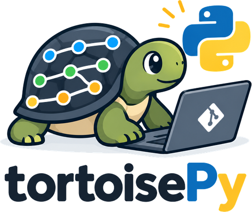

<div align="center">

<picture>
  <source media="(prefers-color-scheme: dark)" srcset="docs/images/logo-dark.png">
  
</picture>

**TortoiseGit's Revision Graph, for macOS and Windows.**

See your repository's history as a graph — and act on it.

</div>

---

## What it is

TortoiseGit's Revision Graph is the clearest view of a Git repository most
developers have ever used. It only runs on Windows, inside Windows Explorer.

tortoisePy is that view, rebuilt as a standalone desktop application that runs
on macOS and Windows — and it does not stop at looking. Right-click a node and
you can checkout, merge, rebase, stash, push, pull, revert, cherry-pick.

It is built on [pygit2](https://www.pygit2.org/) (libgit2) and
[PySide6](https://doc.qt.io/qtforpython-6/) (Qt 6).

## Why you might want it

- **The graph is readable.** Long chains of commits are collapsed into single
  edges labelled with how many commits they hide — so a 3,000-commit history
  renders as a handful of nodes you can actually take in.
- **It is a tool, not a viewer.** Every common Git operation is one right-click
  away, with the destructive ones confirmed by name.
- **It refuses to guess.** Nothing is written to your repository unless you
  activate a command yourself.

## Requirements

- macOS 11+ or Windows 10+
- Git installed and on your `PATH`
- Nothing else — the installer brings its own Python

> **Heads up:** the install downloads about **1.2 GB**. Almost all of it is
> Qt (PySide6), which the graph rendering depends on. This is expected, not a
> problem with your connection.

## Installation

### One command

**macOS and Linux**

```bash
curl -LsSf https://raw.githubusercontent.com/romainh3nry/TortoisePy/v0.12.0/scripts/install.sh | sh
```

**Windows (PowerShell)**

```powershell
irm https://raw.githubusercontent.com/romainh3nry/TortoisePy/v0.12.0/scripts/install.ps1 | iex
```

The script installs [uv](https://docs.astral.sh/uv/) if you don't have it,
then tortoisePy, then checks that the `topy` command actually answers — and
tells you what to do if your `PATH` needs a line added.

### If you'd rather not pipe a script into your shell

That is a reasonable thing to refuse. Two steps instead:

```bash
# 1. Install uv — see https://docs.astral.sh/uv/getting-started/installation/
curl -LsSf https://astral.sh/uv/install.sh | sh          # macOS / Linux
winget install astral-sh.uv                              # Windows

# 2. Install tortoisePy
uv tool install git+https://github.com/romainh3nry/TortoisePy@v0.12.0
```

### Why uv rather than pip

`uv tool install` puts tortoisePy in its own isolated environment, so it
cannot break — or be broken by — anything else you have installed. It also
downloads a suitable Python for you, which matters here: tortoisePy needs
Python 3.13, and you very likely don't have it.

If you prefer `pipx`, it works the same way, but you will need Python 3.13
already installed.

### Updating

Re-run the install command — it always points at the latest released tag:

```bash
# macOS / Linux
curl -LsSf https://raw.githubusercontent.com/romainh3nry/TortoisePy/v0.12.0/scripts/install.sh | sh

# Windows
irm https://raw.githubusercontent.com/romainh3nry/TortoisePy/v0.12.0/scripts/install.ps1 | iex
```

> **`uv tool upgrade tortoisepy` will not work here.** The install pins an
> exact tag, so uv correctly reports *"Nothing to upgrade"* — it is doing what
> a pinned version is for. Re-running the installer is the update path.

### Uninstalling

```bash
uv tool uninstall tortoisepy
```

## Usage

```bash
topy .                 # the repository in the current directory
topy ~/code/my-project # a repository somewhere else
topy                   # same as "topy ."
```

Like `git` itself, `topy` walks up the directory tree — running it from
`my-project/src/utils/` opens `my-project`.

`topy` hands your shell straight back: the window opens in a detached
process, so the terminal stays yours. Closing the last window ends the
process — nothing is left running behind it.

```bash
topy --wait .          # keep the terminal busy until the window closes
topy --help            # usage
topy --version         # version
topy --install-icon    # install the Dock icon (macOS)
```

Use `--wait` when you need the window's exit to gate the next step of a
script.

## What you can do from the graph

Right-click any node:

| | |
|---|---|
| **Move around** | Checkout a branch, create a branch or tag, rename, delete |
| **Integrate** | Merge, rebase, cherry-pick |
| **Undo** | Revert a commit, reset (soft / mixed / hard) |
| **Remote** | Fetch, pull, push, push with `--force-with-lease`, delete a remote branch |
| **Set aside** | Stash changes, apply, pop, drop |
| **Inspect** | Show a commit's files and diff, blame a file, compare two revisions, show a branch's log |
| **Copy** | The SHA, a branch name (local or remote), a file path |

Plus, outside the graph:

- **Commit** — pick files, write a message, optionally amend the last commit
- **Commit part of a file** — tick the hunks you want, like `git add -p`; the
  rest stays in your working tree for the next commit
- **Word-level diff** — within a modified line, the words that actually changed
  are shown in bold, so you don't compare two red-and-green lines by eye
- **Search** — by message, author or SHA; matching nodes are highlighted and
  the commit list filters down
- **File history** — every commit that touched a file, searchable, from the
  commit detail window
- **Resolve conflicts** — after a merge, pull or rebase: choose a side per
  file, or open the three-way editor (yours | result | theirs) and compose the
  result yourself — useful when git flags two unrelated blocks that merely sit
  next to each other
- **Ahead / behind** — the status bar shows how far you have diverged from the
  server, as of your last fetch

### On destructive operations

Anything that can lose work asks first, and says what it is about to do:
`reset --hard`, deleting a branch, dropping a stash, deleting a remote branch.

Force-pushing uses `--force-with-lease` and never plain `--force` — it will
refuse rather than overwrite a colleague's commit that arrived since your last
fetch. `main`, `master` and `develop` cannot be deleted from the remote at all.

## What it does not do

Stated up front so you don't go looking:

- **Interactive rebase** (`rebase -i`) — reordering and squashing commits is an
  application of its own
- **Staging by word** — the changed words are highlighted within a line, but
  you stage whole hunks, not fragments of a line
- **Submodules, worktrees, LFS**

## Building from source

```bash
git clone https://github.com/romainh3nry/TortoisePy
cd TortoisePy
uv venv && uv pip install -e ".[dev]"
uv run pytest
uv run topy .
```

## Contributing

Issues and pull requests are welcome. Two things worth knowing before you
start:

- **The graph rendering is settled.** Curves, arrows, spacing and colours were
  tuned by eye and are not up for casual revision.
- **Tests come first.** Every behaviour in this project was specified, tested,
  and then verified against a real repository — including the ones that look
  obvious.

## Releasing

The version lives in **one place**: the `version` field of `pyproject.toml`.
Everything else — the install URLs in this README, the `VERSION` variable in
both installers — is a copy, and one script rewrites them all:

```bash
python scripts/set-version.py X.Y.Z
```

It prints what it changed, refreshes your local `.venv` so
`topy --version` keeps up, and leaves Git alone. Commit, then tag:

```bash
git tag vX.Y.Z && git push origin vX.Y.Z
```

The tag matters: the install commands above point at it, so a release without
one gives a 404.

Why copies rather than a single value read at runtime: both installers run
*before* anything is cloned, so `pyproject.toml` does not yet exist on the
user's machine when `curl … | sh` starts. Their version has to be written in.
Three tests keep the copies honest — one of them fails if a new file ever
pins the version without being declared in the script.

## Licence

[MIT](LICENSE) — do what you like with it, keep the copyright notice, and
don't hold me liable.
